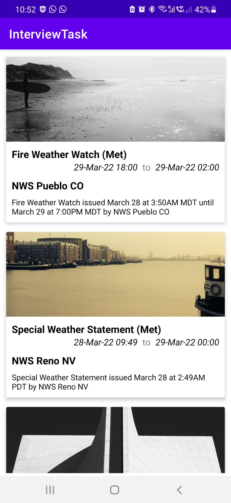
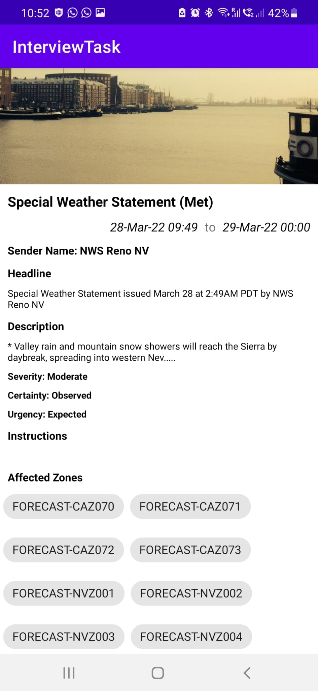
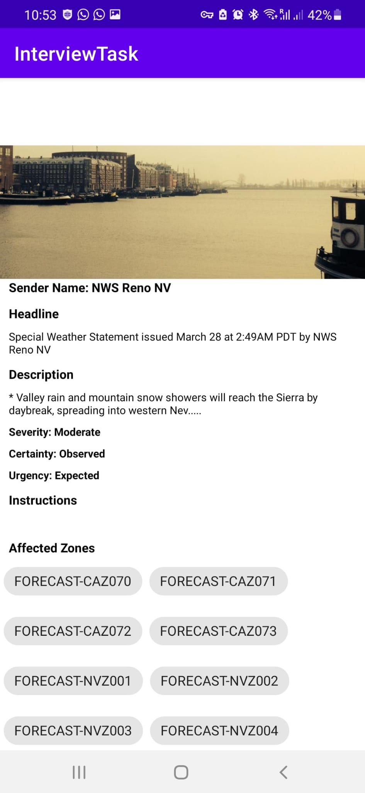

# Interview Task - Android Application 

This repository contains an android app for interview purpose. It implements MVVM architecture using Koin ID, Retrofit, Coroutine, ViewModel, CardView, Chipgroup, Navigation, LiveData and Recyclerview.

  
  
  

 
 

#### The app has following packages:
1. **adapters**: It contains the recyclerview adapter.
2. **di**: Dependency providing classes using Koin.
3. **model**: It contains all the data accessing and manipulating components.
4. **rest**: It contains the repository and api endpoint declarations
5. **utils**: It contains the utility classes and pagination listener.
6. **ui**: UI classes along with their corresponding ViewModel.
"# MochaSolution" 

Solution 1

override fun onCreate(savedInstanceState: Bundle?) {
        super.onCreate(savedInstanceState)
        setContentView(R.layout.activity_main2)
        val txt_sample=findViewById<TextView>(R.id.txt_sample)
    }

    fun updateString(inputString:String):SpannableStringBuilder {
        val spannable = SpannableStringBuilder(inputString)
        var resultinputString = doUpdate(spannable, "@")
        resultinputString = doUpdate(resultinputString, "$")
        resultinputString = doUpdate(resultinputString, "#")
        return resultinputString
    }

    fun doUpdate(myinputString: SpannableStringBuilder, conditionchar: String): SpannableStringBuilder {
        var indexstart = 0
        var indexend = 0
        myinputString.toString().toCharArray().forEach {
            if(indexend!=0){
                indexstart = myinputString.toString().indexOf(conditionchar, indexend+1)
            }else{
                indexstart = myinputString.toString().indexOf(conditionchar)
            }
            indexend = myinputString.toString().indexOf(conditionchar, indexstart+1)
            if (indexstart > -1
                && indexend > -1
                && indexend>0
                && indexstart<myinputString.toString().length
                && indexend<myinputString.toString().length
            ) {
                when (conditionchar) {
                    "#" -> {
                        myinputString.delete(indexstart, indexend+1)
                        indexstart = 0
                        indexend = 0
                    }
                    "$" -> {
                        myinputString.setSpan(
                            StyleSpan(Typeface.ITALIC),
                            indexstart,
                            indexend,
                            Spannable.SPAN_EXCLUSIVE_EXCLUSIVE
                        )
                    }
                    "@" -> {
                        myinputString.setSpan(
                            StyleSpan(Typeface.BOLD),
                            indexstart,
                            indexend,
                            Spannable.SPAN_EXCLUSIVE_EXCLUSIVE
                        )
                    }
                }
            }
        }
        return myinputString
    }
