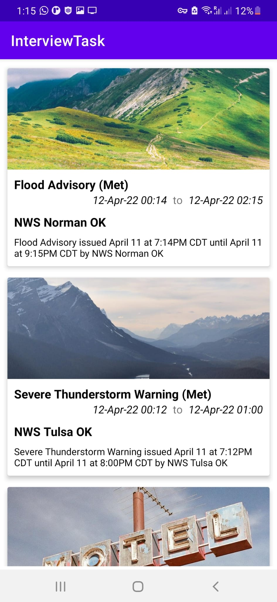
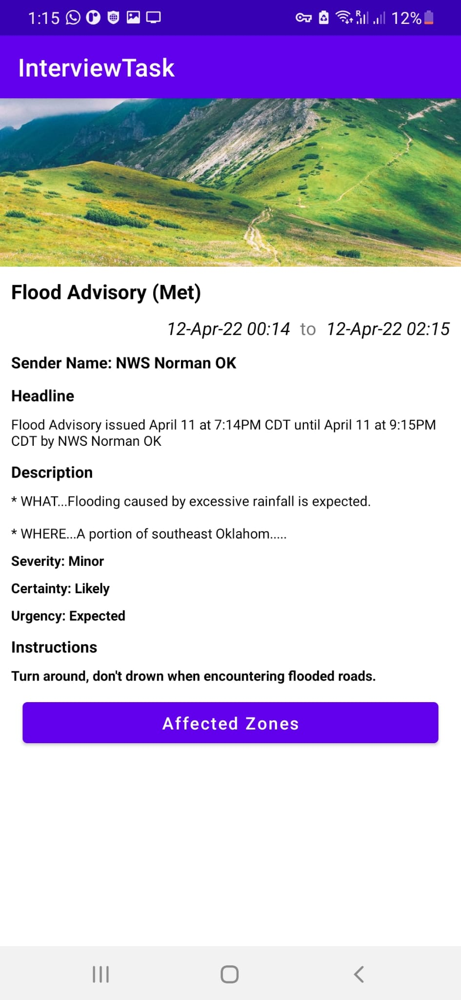
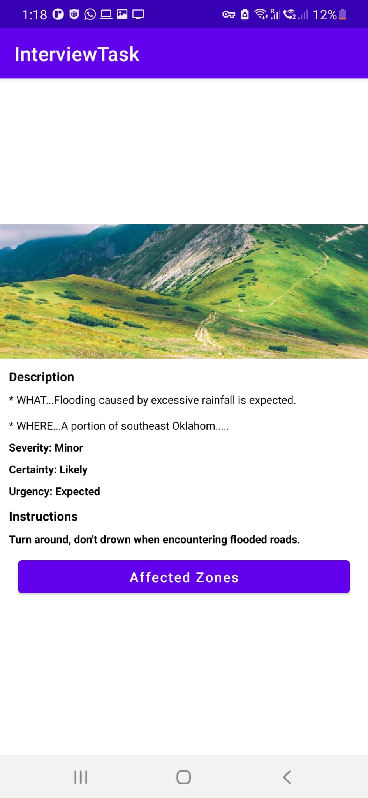
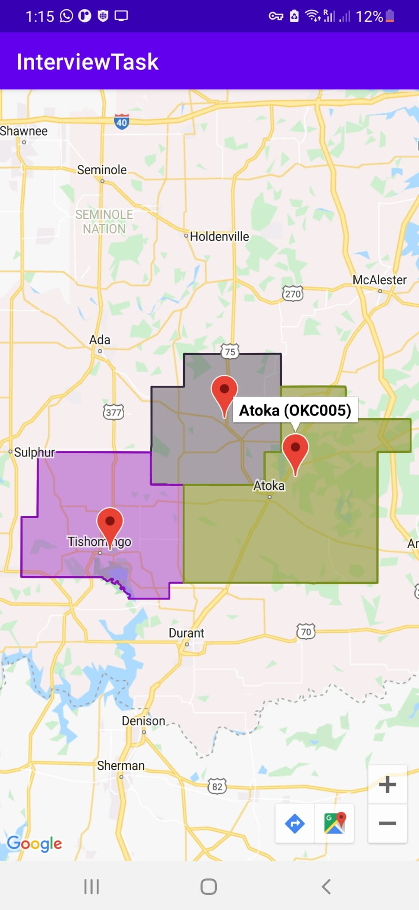

# Interview Task - Android Application 

This repository contains an android app for interview purpose. It implements MVVM architecture using Koin ID, Retrofit, Coroutine, ViewModel, CardView, Chipgroup, Navigation, LiveData and Recyclerview.

  
  
  
  

 
 

#### The app has following packages:
1. **adapters**: It contains the recyclerview adapter.
2. **di**: Dependency providing classes using Koin.
3. **model**: It contains all the data accessing and manipulating components.
4. **rest**: It contains the repository and api endpoint declarations
5. **utils**: It contains the utility classes and pagination listener.
6. **ui**: UI classes along with their corresponding ViewModel.
